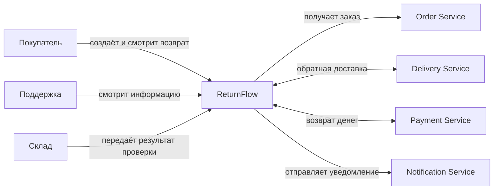
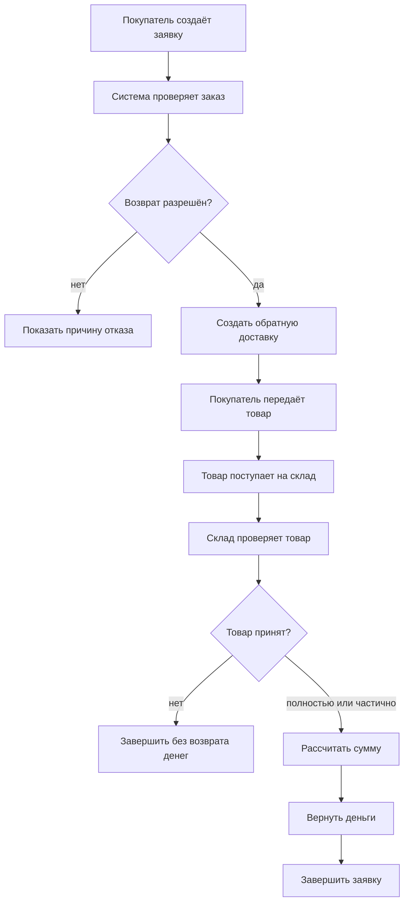
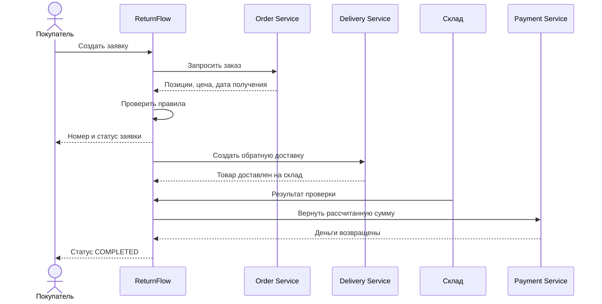
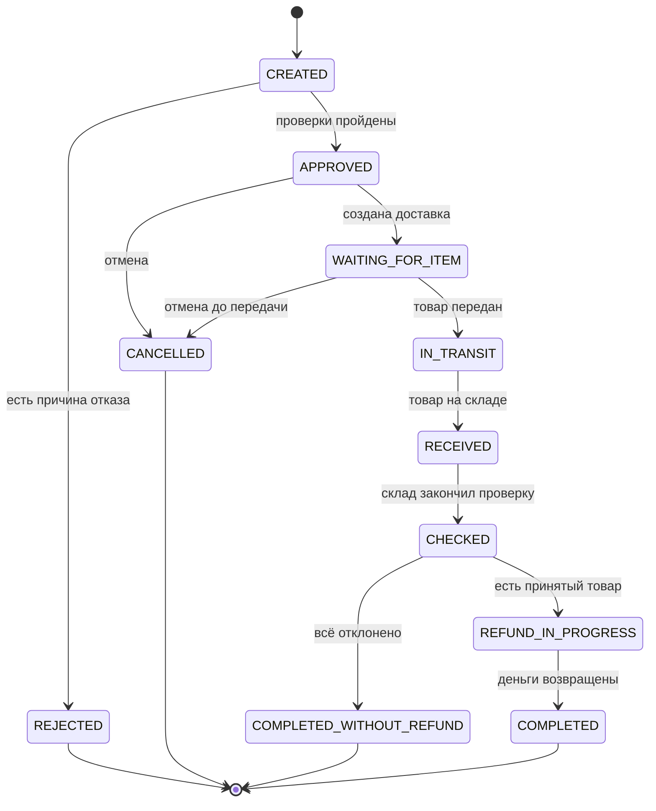

# Диаграммы

## Контекст системы

```mermaid
flowchart LR
    Customer["Покупатель"] -->|"создаёт и смотрит возврат"| ReturnFlow["ReturnFlow"]
    Support["Поддержка"] -->|"смотрит информацию"| ReturnFlow
    Warehouse["Склад"] -->|"передаёт результат проверки"| ReturnFlow

    ReturnFlow -->|"получает заказ"| Order["Order Service"]
    ReturnFlow <-->|"обратная доставка"| Delivery["Delivery Service"]
    ReturnFlow <-->|"возврат денег"| Payment["Payment Service"]
    ReturnFlow -->|"отправляет уведомление"| Notification["Notification Service"]
```

## Процесс возврата

```mermaid
flowchart TD
    A["Покупатель создаёт заявку"] --> B["Система проверяет заказ"]
    B --> C{"Возврат разрешён?"}
    C -->|"нет"| D["Показать причину отказа"]
    C -->|"да"| E["Создать обратную доставку"]
    E --> F["Покупатель передаёт товар"]
    F --> G["Товар поступает на склад"]
    G --> H["Склад проверяет товар"]
    H --> I{"Товар принят?"}
    I -->|"нет"| J["Завершить без возврата денег"]
    I -->|"полностью или частично"| K["Рассчитать сумму"]
    K --> L["Вернуть деньги"]
    L --> M["Завершить заявку"]
```

## Создание и обработка возврата

```mermaid
sequenceDiagram
    actor C as Покупатель
    participant R as ReturnFlow
    participant O as Order Service
    participant D as Delivery Service
    participant W as Склад
    participant P as Payment Service

    C->>R: Создать заявку
    R->>O: Запросить заказ
    O-->>R: Позиции, цена, дата получения
    R->>R: Проверить правила
    R-->>C: Номер и статус заявки
    R->>D: Создать обратную доставку
    D-->>R: Товар доставлен на склад
    W->>R: Результат проверки
    R->>P: Вернуть рассчитанную сумму
    P-->>R: Деньги возвращены
    R-->>C: Статус COMPLETED
```

## Статусы заявки

```mermaid
stateDiagram-v2
    [*] --> CREATED
    CREATED --> APPROVED: проверки пройдены
    CREATED --> REJECTED: есть причина отказа
    APPROVED --> WAITING_FOR_ITEM: создана доставка
    APPROVED --> CANCELLED: отмена
    WAITING_FOR_ITEM --> CANCELLED: отмена до передачи
    WAITING_FOR_ITEM --> IN_TRANSIT: товар передан
    IN_TRANSIT --> RECEIVED: товар на складе
    RECEIVED --> CHECKED: склад закончил проверку
    CHECKED --> REFUND_IN_PROGRESS: есть принятый товар
    CHECKED --> COMPLETED_WITHOUT_REFUND: всё отклонено
    REFUND_IN_PROGRESS --> COMPLETED: деньги возвращены
    REJECTED --> [*]
    CANCELLED --> [*]
    COMPLETED_WITHOUT_REFUND --> [*]
    COMPLETED --> [*]
```

