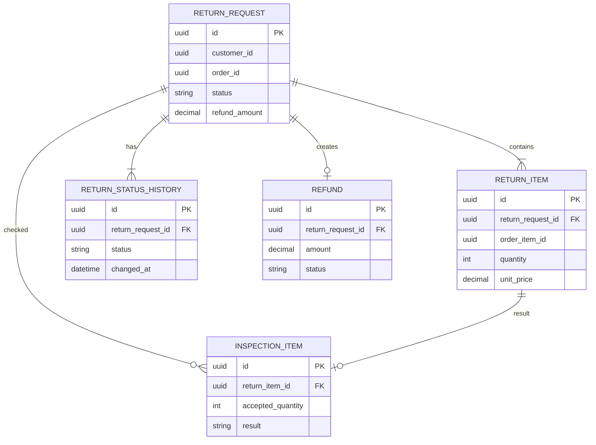

# Модель данных

SQL-скрипт находится в [database/schema.sql](../database/schema.sql).

## Основные таблицы

### `return_request`

Основная информация о заявке: покупатель, заказ, статус, способ передачи и сумма возврата.

### `return_item`

Позиции, которые покупатель хочет вернуть. Цена сохраняется в заявке, чтобы потом правильно рассчитать сумму.

### `return_status_history`

История смены статусов. Нужна для поддержки и разбора проблем.

### `inspection_item`

Результат проверки каждой позиции на складе: сколько получили, сколько приняли и почему могли отказать.

### `refund`

Информация о запросе на возврат денег и ответе Payment Service.

## Связи

Деньги хранятся в `numeric(12,2)`, потому что тип `float` может давать неточность при расчётах.

